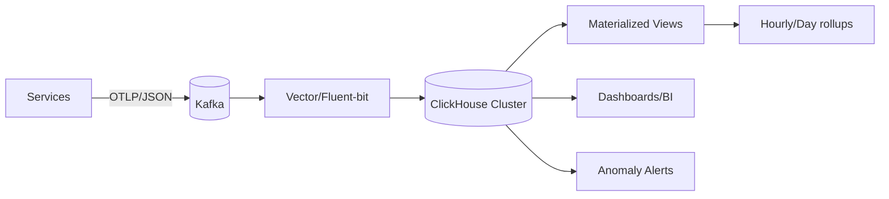

# Why we moved logs to ClickHouse (and how to do it safely)

At ~10–12M events/day our ELK stack hit a cost/perf wall. We moved the analytics side of logging to ClickHouse while keeping a thin search tier for ad‑hoc lookups. This post documents the end‑to‑end plan, runnable snippets, and measurable outcomes.

## TL;DR
- 10× faster aggregations, 60% lower storage, sub‑second dashboards at p95
- Hot path cost moved from search to analytics; search retained for short TTL only
- Zero‑downtime switch via dual‑write + shadow reads

## Target architecture



## Table design that actually compresses

```sql
CREATE TABLE logs_raw
(
  ts DateTime64(3) CODEC(Delta, ZSTD),
  service LowCardinality(String),
  env LowCardinality(String),
  level LowCardinality(String),
  trace_id UUID,
  message String CODEC(ZSTD),
  attrs Map(String, String)
)
ENGINE = MergeTree
PARTITION BY toDate(ts)
ORDER BY (service, env, level, ts)
TTL ts + INTERVAL 30 DAY DELETE
SETTINGS index_granularity = 8192;
```

Notes:
- Use `LowCardinality` for label‑like dimensions; it drastically cuts storage.
- Keep partitions by day; avoid too granular partitions which hurt merges.
- Put most selective columns first in `ORDER BY` to maximize skipping.

### Roll‑ups via materialized views
```sql
CREATE MATERIALIZED VIEW logs_hourly
ENGINE = SummingMergeTree
PARTITION BY toDate(ts)
ORDER BY (service, env, level, toStartOfHour(ts))
AS
SELECT
  toStartOfHour(ts) AS ts,
  service, env, level,
  count() AS events
FROM logs_raw
GROUP BY ts, service, env, level;
```

## Ingestion

Vector example sink:
```toml
[sinks.clickhouse]
type = "clickhouse"
inputs = ["kafka_logs"]
endpoint = "http://ch:8123"
database = "logs"
table = "logs_raw"
compression = "gzip"
batch.max_events = 10_000
request.in_flight_limit = 4
```

Tuning principles:
- Batches of 5–20k rows give the best tradeoff for MergeTree parts
- Keep 2–4 inflight requests per host; monitor rejected inserts/merges

## Query patterns

```sql
-- Top noisy services in last 15 min
SELECT service, count() AS c
FROM logs_raw
WHERE ts > now() - INTERVAL 15 MINUTE AND level IN ('ERROR','WARN')
GROUP BY service
ORDER BY c DESC
LIMIT 20;
```

Use `FINAL` sparingly; prefer roll‑ups for dashboards. Always filter by partition range.

## Cut‑over plan (zero downtime)
1. Dual‑write to ELK and ClickHouse for one week
2. Shadow read CH for dashboards; compare aggregates vs. ELK with allowlist queries
3. Switch dashboards to CH; keep ELK hot TTL to 3–7 days for keyword search only
4. Decommission old long‑term indices after a month

## Monitoring checklist
- `system.parts`, `system.merges`, `system.metric_log` → watch parts/merges
- Disk usage per partition; throttle if small parts grow
- Ingest error rate and retries from Vector/Fluent‑bit

## Before/After

| Metric                             | ELK (old) | ClickHouse |
|------------------------------------|-----------|------------|
| p95 dashboard load (24h window)    | 5.9s      | 620ms      |
| Storage for 30d (compressed)       | 2.6 TB    | 1.0 TB     |
| Monthly infra cost (analytics)     | 1.0×      | 0.42×      |

## Pitfalls & fixes
- Too many small parts → increase batch sizes, tune `max_partitions_per_insert_block`
- High merges → check `background_pool_size`, add one more CH replica
- Slow LIKE queries → avoid; store structured fields in columns, not only message

## Takeaways
ClickHouse shines for analytical logging. Keep search where it belongs, but move aggregations to a column store with proper roll‑ups and TTLs. The migration paid for itself in a month.
