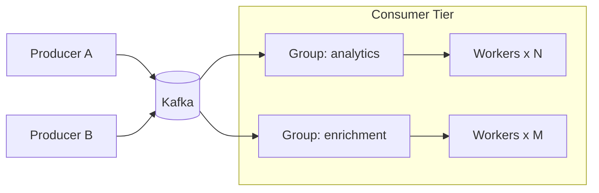

# Scaling Kafka Consumers for 10M+ events/day (without burning CPUs)

This is the blueprint we used to scale from 500k → 10M+ events/day with predictable costs and <1s lag.

## Reference topology


## Partitioning that balances
Use a stable key that matches your concurrency boundary. For user‑centric streams:

```java
int partition = Math.floorMod(userId.hashCode(), partitionCount);
producer.send(new ProducerRecord<>("events", partition, key, value));
```

Guidelines:
- Partitions >= peak consumer concurrency
- Avoid keys with hot‑spot skew; consider bucketing (e.g., hash(userId) % 256) then route to partitions

## Consumer configuration

```properties
fetch.max.bytes=20MB
max.partition.fetch.bytes=8MB
max.poll.records=1000
max.poll.interval.ms=300000
enable.auto.commit=false
session.timeout.ms=45000
```

Manually commit in batches; idempotent processing guarantees exactly‑once at the app level.

## Backpressure & autoscaling

```java
@KafkaListener(topics = "events", containerFactory = "kafkaListenerContainerFactory")
public void onMessage(ConsumerRecord<String, String> record, Acknowledgment ack) {
    if (rateLimiter.tryAcquire()) {
        handle(record);
        if (++processed % 500 == 0) ack.acknowledge();
    } else {
        // Let the poll timeout hit → lag rises → HPA scales
        return;
    }
}
```

Autoscale on a lag SLO, not CPU:
- Metric: `kafka_consumergroup_lag` p90 < 1000 messages
- HPA/KEDA scale out when lag > threshold for 2–3 minutes

## Retry and poison‑pill handling
Dead‑letter with headers, cap retries with exponential backoff, and keep the hot path fast:

```java
record.headers().add("x-retry", Integer.toString(retry).getBytes(StandardCharsets.UTF_8));
```

## Results
- Stable throughput at 10M+/day
- Lag < 1s (p95), CPU within 55–65%
- Linear scale by adding partitions and worker pods

## Checklist
- [ ] Key selection avoids skew
- [ ] Auto‑commit disabled; batch commits
- [ ] Lag‑based autoscaling
- [ ] Bounded retries + DLQ
