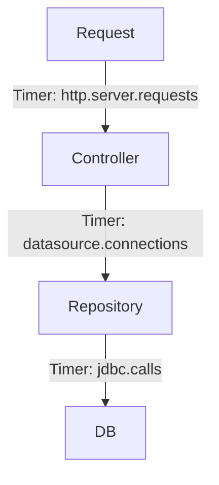

# Cutting p99 from 380ms → 190ms in Spring Boot

Performance optimization is both an art and a science. Here's how we systematically reduced our API latency by 50%.

## The Investigation

Our monitoring showed concerning p99 latencies:
- Average response time: 45ms
- p95: 120ms  
- p99: 380ms (unacceptable!)

## Root Cause Analysis

Using profiling tools, we identified several bottlenecks:

### 1. Database Connection Pool Exhaustion
```yaml
# Before
spring.datasource.hikari.maximum-pool-size: 10

# After  
spring.datasource.hikari.maximum-pool-size: 25
spring.datasource.hikari.minimum-idle: 10
```

### 2. JVM Garbage Collection
G1GC tuning made a significant impact:
```bash
-XX:+UseG1GC
-XX:MaxGCPauseMillis=100
-XX:G1HeapRegionSize=16m
```

### 3. Inefficient Queries
We optimized our most expensive queries and added proper indexing.

### 4. Thread‑pool hygiene
```yaml
server.tomcat.threads.max: 200
spring.task.execution.pool.core-size: 16
spring.task.execution.pool.max-size: 64
spring.task.execution.pool.queue-capacity: 1000
```

### 5. Metrics that matter

We drove changes by dashboards for p50/p95/p99, connection pool usage, and GC pauses.

## Results

After implementing all optimizations:
- p99 latency: 190ms (50% improvement)
- p95 latency: 65ms (46% improvement)  
- Throughput increased by 30%

The key was systematic measurement and incremental improvements.
